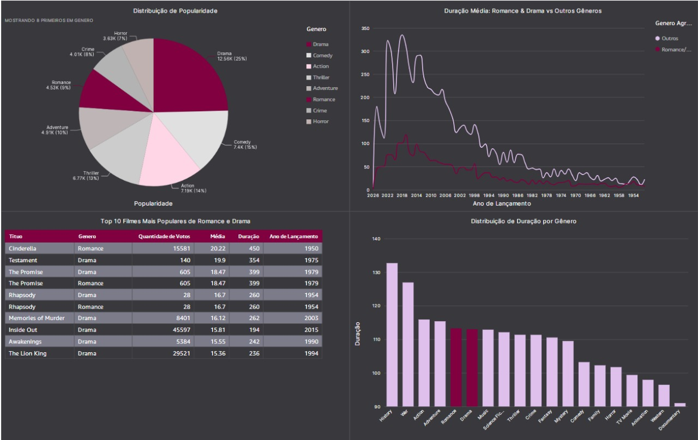

# Etapa 4 - Dashboard

> Este dashboard foi desenvolvido no **Amazon QuickSight** com base na **camada Refined** do Data Lake, permitindo a visualização de métricas consolidadas sobre os filmes.
> 

## 🔹 **Principais Métricas**

- ⭐ **Média de Avaliação** dos filmes
- 👥 **Número de votos** por filme
- 🎭 **Distribuição por gênero**
- 🔝 **Filmes mais populares**

[📄 Visualizar Dashboard (PDF)](./Dashboard.pdf)