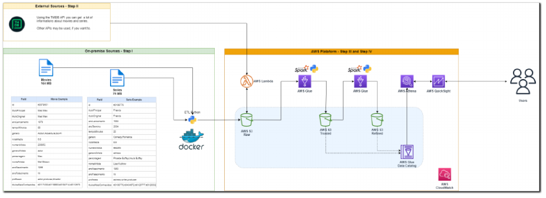

# 🎬 Filmes e Séries Data Lake
>   Status: Em desenvolvimento

> Um projeto desenvolvido no Programa de Bolsas da Compass UOL, que simula a construção de um Data Lake completo, desde a ingestão até o consumo dos dados, com foco em aprendizado de engenharia de dados.
> 

Este projeto tem como objetivo **construir um Data Lake simplificado** para iniciantes, permitindo explorar todo o fluxo de dados: ingestão, armazenamento, processamento e análise.

---

## 📝 Descrição do Desafio

O desafio consiste em criar um **Data Lake de filmes e séries**, seguindo as etapas:

1. **Ingestão de dados**
    - A partir de arquivos CSV locais com informações de filmes e séries.
    - A partir da **API do TMDB**, trazendo dados complementares em formato JSON.
2. **Armazenamento na camada RAW**
    - Guardar os dados brutos sem alterações, preservando integridade e rastreabilidade.
3. **Processamento e padronização (Camada TRUSTED)**
    - Normalizar os dados, corrigir inconsistências e catalogar em tabelas.
    - Transformar o modelo para que seja **pronto para análises e consultas**.
4. **Processamento avançado (Camada REFINED)**
    - Aplicar o **Apache Spark** para criar agregações, métricas e modelos dimensionais.
    - Catalogar e armazenar os dados processados para consumo final.
5. **Consumo e análise**
    - Construção de **dashboards analíticos** para responder perguntas estratégicas sobre filmes e séries.

---

## 🔍 Análise prevista

A análise central do projeto será:

- **Qual é a participação dos filmes de Romance e Drama entre os títulos mais populares?**
    - Considerando **número de votos** e **nota média**.
- **Qual é o tempo médio de duração desses filmes em comparação aos demais gêneros?**

> Esta análise permitirá identificar padrões de popularidade e duração dentro dos gêneros mais assistidos.
> 

---

## 📊 Tecnologias Utilizadas

| Tecnologia | Finalidade |
| --- | --- |
| Python | Scripts de ingestão, processamento e análise |
| Pandas | Manipulação de dados CSV/JSON |
| Boto3 | Integração com S3 |
| Apache Spark | Processamento distribuído de dados |
| Docker | Isolamento das pipelines |
| Quicksight | Construção do Dashboard |

---

## 🗂 Estrutura do Projeto

```bash
filmes-series-data-lake/
│── Etapa-1/       # Ingestão CSV e API TMDB (Camada RAW)
│── Etapa-2/       # Limpeza e padronização dos Dados (Camada TRUSTED)
│── Etapa-3/       # Modelagem Dimensional (Camada REFINED)
│── Etapa-4/       # Construção do Dashboard
│── data/sample/   # Amostras de dados para testes
│── assets/      # Imagens utilizadas nos Readmes
│── README.md      # Este arquivo

```

---

## 💡 Observações

- Os arquivos CSV e JSON brutos **não estão versionados no GitHub**, apenas amostras para testes.
- Variáveis sensíveis (AWS keys, TMDB API Key) devem ser definidas em um arquivo `.env`.
- Cada etapa do pipeline possui seu **README detalhado**, explicando o fluxo, variáveis e instruções de execução.



[1️⃣ Etapa 1](Etapa-1)

[2️⃣ Etapa 2](Etapa-2)

[3️⃣ Etapa 3](Etapa-3)

[4️⃣ Etapa 4](Etapa-4)
